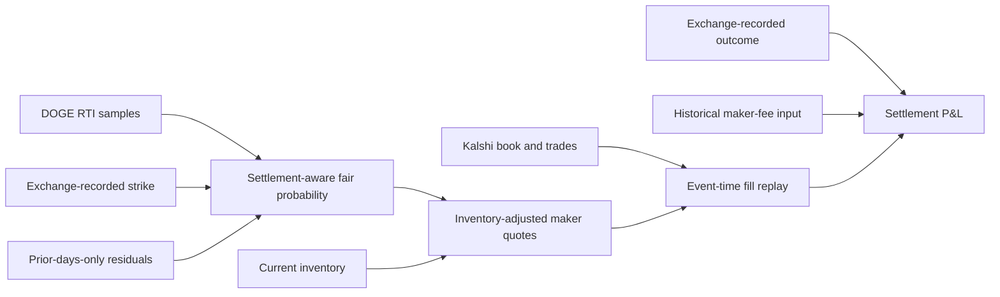

# KXDOGE15M research documentation

This documentation explains the probability model, historical backtesting methodology, and current results in this repository. It is organized by subject rather than as a chronological research report.

## Documentation map

1. [Probability model](model.md) — the $[T-60,T)$ settlement payoff, known and unknown settlement samples, local GBM moments, the moment-matched lognormal approximation, and prior-days-only residual calibration.
2. [Backtesting and execution](backtesting.md) — exchange-recorded labels, walk-forward testing, inventory-adjusted maker quotes, latency, trade-through and queue-aware fills, P&L accounting, uncertainty, and replay limitations.
3. [Current results and interpretation](results.md) — probability accuracy, last-minute 1x/10x maker results, alternative probability calculations, full-market replay, temporal out-of-sample results, interpretation, and next steps.

## System overview

The system has two separate jobs:

- **Valuation:** estimate the probability that the final 60-second RTI average is at least the strike.
- **Execution:** decide whether a displayed price offers enough edge and determine whether a hypothetical resting order would have filled.

Keeping these jobs separate makes the backtest easier to audit. A good probability forecast does not automatically imply executable profit, and profitable simulated fills do not prove that the probability model is correctly specified. Primary tests use exchange-recorded targets at both ends; local settlement reconstruction is used for implementation validation and data-quality checks.

## Code map

| Component | Implementation |
| --- | --- |
| Settlement replay and probability features | [`src/kxdoge_backtest/core.py`](../src/kxdoge_backtest/core.py) |
| Walk-forward calibration and scores | [`src/kxdoge_backtest/calibration.py`](../src/kxdoge_backtest/calibration.py) |
| Database loading | [`src/kxdoge_backtest/database.py`](../src/kxdoge_backtest/database.py) |
| Event-time maker simulation | [`src/kxdoge_backtest/maker.py`](../src/kxdoge_backtest/maker.py) |
| Probability CLI | [`src/kxdoge_backtest/cli.py`](../src/kxdoge_backtest/cli.py) |
| Maker CLI | [`src/kxdoge_backtest/maker_cli.py`](../src/kxdoge_backtest/maker_cli.py) |

## Scope

The documentation centers on the discrete arithmetic-average model because it matches the contract's actual settlement rule. Its primary implementation moment-matches the remaining correlated GBM price sum to a lognormal distribution and then applies walk-forward empirical residual calibration.

The repository also contains an older geometric-average approximation and two tested alternatives: deterministic Sobol Monte Carlo evaluation of the remaining GBM sum and a pure empirical model that does not use GBM or current volatility. Their economic comparisons are reported in the results document.

Maker results use both trade-through and queue-aware fill assumptions with 250 milliseconds of placement and cancellation latency. The tested historical period used zero base maker fees. All backtests are historical counterfactual replays, not live trading results.
